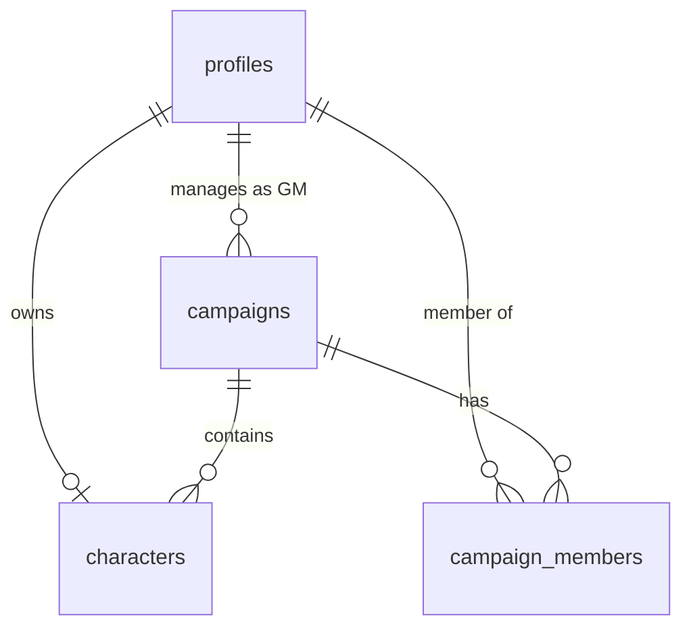

# BattleTech RPG Helper

[](https://opensource.org/licenses/MIT)
[](https://nextjs.org)
[](https://developer.mozilla.org/en-US/docs/Web/Progressive_web_apps)

**BattleTech RPG Helper** is a modern, mobile-friendly web port and rewrite of the original C++/Qt desktop [BattleTech Character Creator](https://github.com/bearchik/Battletech-Character-Creator). It is designed to assist players and Game Masters (GMs) of the *Classic BattleTech: A Time of War* RPG by providing seamless character creation, cloud syncing, and real-time campaign management.

The project is structured as an installable Progressive Web App (PWA) that bridges the gap between offline desktop tools and cloud-enabled collaborative play.

---

## 🌟 Key Features

- **☁️ Cloud Sync & Data Consistency**: No more loose files. Characters live in a secure cloud database and are instantly accessible on any device.
- **👁️ Game Master (GM) Oversight**: Create or join campaigns. GMs have full visibility and live editing capabilities for all player characters in their campaigns.
- **📱 Installable PWA (Mobile-First)**: Built to work beautifully on mobile viewports at the gaming table, with offline support powered by Serwist.
- **🔄 `.btcc` Native Import/Export**: Fully compatible with the desktop app. Supports importing existing `.btcc` character sheets and exporting them with 100% byte-compatibility.
- **⚡ Real-Time Syncing**: Real-time collaborative editing. GMs can edit character sheets, and players see updates immediately, and vice-versa.

---

## 🛠️ Technology Stack

- **Frontend Framework**: [Next.js](https://nextjs.org/) (App Router, React, TypeScript)
- **Styling**: [Tailwind CSS](https://tailwindcss.com/)
- **Backend & Database**: [Supabase](https://supabase.com/) (PostgreSQL, GoTrue Auth, Realtime, Row-Level Security)
- **State Management & Forms**: `react-hook-form` + `zod`
- **Offline / PWA**: `@serwist/next` (Service Workers)
- **Testing**: [Vitest](https://vitest.dev/) (Unit / Integration) & [Playwright](https://playwright.dev/) (E2E)

---

## 🗄️ Database Architecture

To ensure strict data security and compliance with GM/Player relationships, authorization is enforced entirely at the database layer via Supabase **Row-Level Security (RLS)**.



### Table Schema Highlights

1. **`profiles`**: User metadata synchronized with auth accounts.
2. **`campaigns`**: Campaign records with a unique invite code.
3. **`campaign_members`**: Link table defining roles (`gm`, `player`) within campaigns.
4. **`characters`**: Character sheets stored with JSONB documents for attributes, skills, and traits to maintain exact ordering for desktop compatibility.

*For detailed specifications, see the database design and RLS policy rules in the [PLAN.md](file:///home/orin/Work/Personal/battletech-rpg-helper/docs/PLAN.md).*

---

## 🔄 `.btcc` Compatibility

One of the project's primary goals is **byte-compatible round-trip fidelity** with the C++/Qt desktop app.
- **Importing**: Parsed entirely client-side. The file is validated against the catalog rules, translating attributes, traits, and skills into application state.
- **Exporting**: Regenerates the `.btcc` format using desktop key order, formatting, and notes.

---

## 🚀 Getting Started

### Prerequisites

- Node.js (v18.x or later)
- npm
- A Supabase project instance

### Installation

1. **Clone the repository**:
   ```bash
   git clone https://github.com/your-username/battletech-rpg-helper.git
   cd battletech-rpg-helper
   ```

2. **Install dependencies**:
   ```bash
   npm install
   ```

3. **Set up local environment variables**:
   Create a `.env.local` file in the root directory:
   ```env
   NEXT_PUBLIC_SUPABASE_URL=your-supabase-url
   NEXT_PUBLIC_SUPABASE_ANON_KEY=your-supabase-anon-key
   SUPABASE_SERVICE_ROLE_KEY=your-supabase-service-role-key
   ```

4. **Ingest Rules Data**:
   Convert the raw game tables into static typed JSON:
   ```bash
   npm run rules:ingest
   ```

5. **Start the development server**:
   ```bash
   npm run dev
   ```

---

## 🧪 Testing

The test suite runs using Vitest for logic checks and Playwright for cross-device verification.

- **Run unit tests** (including the `.btcc` serialization golden test):
  ```bash
  npm run test
  ```
- **Run end-to-end tests**:
  ```bash
  npm run test:e2e
  ```

---

## 🤝 Contributing

We welcome contributions from the BattleTech community! Please read our [Contribution Guidelines](CONTRIBUTING.md) and check out our [Development Roadmap](file:///home/orin/Work/Personal/battletech-rpg-helper/docs/PLAN.md) before starting.

1. Fork the Project.
2. Create your Feature Branch (`git checkout -b feature/AmazingFeature`).
3. Commit your Changes (`git commit -m 'Add some AmazingFeature'`).
4. Push to the Branch (`git push origin feature/AmazingFeature`).
5. Open a Pull Request.

---

## 📄 License

Distributed under the MIT License. See `LICENSE` for more information.
